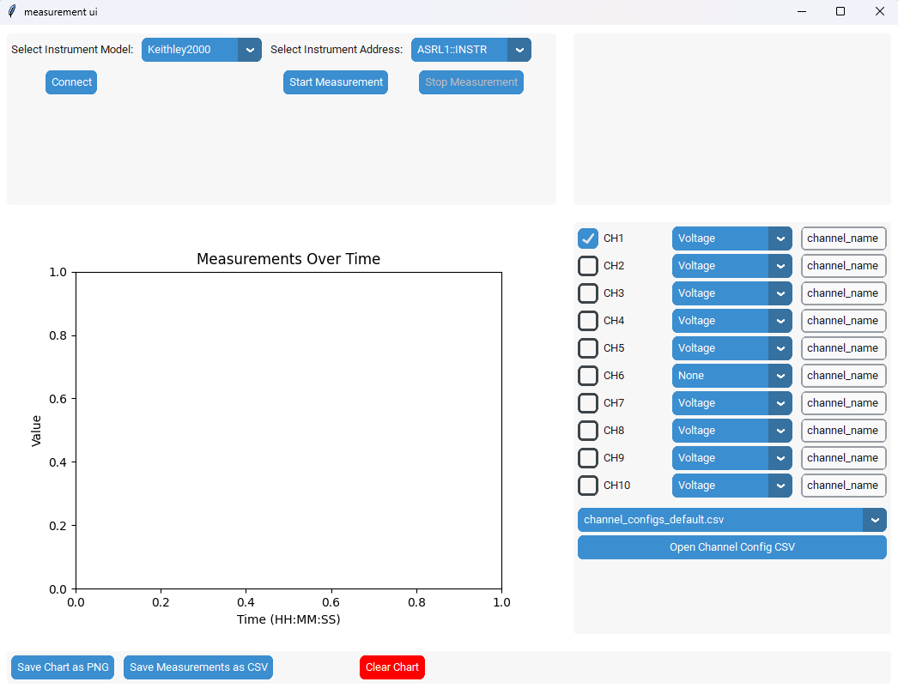

# Material Outgassing Test Rig Data Logger

This repository contains the software for the Material Outgassing Test Rig Data Logger. This system is designed to monitor and log various parameters during material outgassing tests.



## Virtual Environment Setup

To set up a virtual environment for this project, follow these steps:

1. **Create a Virtual Python 3.10 Environment:**
   Download python 3.10.X from the [python website](https://www.python.org/downloads/windows/)

   ```sh
   python -3.10 -m venv venv
   ```

2. **Activate the Virtual Environment:**
  
    ```sh
    venv\Scripts\activate
    ```

3. **Install Required Packages:**

   ```sh
   pip install -r requirements.txt
   ```

## Keithley 2000 Multiplexer Setup

[Documentation](https://www.tek.com/en/search?keywords=2000&facets=_templatename%3dmanual&sort=desc) of Keithley 2000 Multiplexer

* **Install Keysight IO** you can download the latest version of the Keysight I/O from the [Keysight website](https://www.keysight.com/us/en/lib/software-detail/computer-software/io-libraries-suite-downloads-2175637.html). This software is essential for communicating with Keithley instruments.
  * Install "IO library" and leave everything at default settings.
  * open the "Connection Expert" and add the Keithley instrument.
  * Make sure to select the correct communication port (e.g., COM1, COM2, GPIB, Serial) and configure the settings according to your instrument's specifications.
  * You might have to install the driver for the connection adapter (e.g., [UPort1150](https://www.moxa.com/en/products/industrial-edge-connectivity/usb-to-serial-converters-usb-hubs/usb-to-serial-converters/uport-1100-series#resources)).
* Once the connection is established, you can test the communication by running following command in the terminal:
  
    ```sh
    python -c "import pyvisa; print(pyvisa.ResourceManager().list_resources())"
    ```

    the output should include the address of your Keithley instrument (e.g., `('ASRL1::INSTR',)`).

* **General mode of operation:**
  The Keithley 2000 can be configured to measure different parameters such as voltage, current, and resistance, frequency, etc. In order to measure a specific channel, the script will follow this pseudo code:

   ```python
   inst.configure(channel)  # Configure the instrument for the specified channel
   inst.open_channel(channel) # Open the specified channel, such that the instrument is ready to measure
   inst.measure_value() # Measure the value with the configured settings
   ```

## Keysight DAQ970A Setup

* **Install Keysight IO** you can download the latest version of the Keysight I/O from the [Keysight website](https://www.keysight.com/us/en/lib/software-detail/computer-software/io-libraries-suite-downloads-2175637.html). This software is essential for communicating with Keysight instruments.
  * Install "IO library" and leave everything at default settings.
  * open the "Connection Expert" and add the Keysight instrument.
* Once the connection is established, you can test the communication by running following command in the terminal:
  
    ```sh
    python -c "import pyvisa; print(pyvisa.ResourceManager().list_resources())"
    ```

    the output should include the address of your Keysight instrument (e.g., `('USB0::0x2A8D::0x5101::MY58036432::0::INSTR',)`).

* **Connect the DAQ970A to your PC:**
  * By LAN:
    * Connect it via lan and add the instrument in the Keysight Connection Expert. You should be able to see the device in the browser when searching for its [IP address](http://172.16.10.196/Index.asp)
  * Via USB:
    * Connect the USB cable from the DAQ970A to your PC. You should be able to see the device in the Keysight Connection Expert.

<!-- Download the latest python driver for the Keysight DAQ970A from the [Keysight website](https://www.keysight.com/us/en/lib/software-detail/driver/daq970-data-acquisition-system-python-instrument-drivers.html). This driver is essential for communicating with the Keysight DAQ970A instrument.

Connect it via lan and add the instrument in the Keysight Connection Expert.
You should be able to see the device in the browser when searching for its [IP address](http://172.16.10.196/Index.asp)

[Python Programming Example](https://docs.keysight.com/kkbopen/programming-example-how-to-use-external-data-logger-elog-with-python-programming-620698733.html) -->

## Run the Data Logger:**

In order to run the data logger, you can use the following command:

```sh
python src/main.py
```

You can also create a shortcut to the launch_main.bat file for easier access on the Desktop. this simply executes the command above.

This will start the data logger window, where you can select the instrument to use, the channels to measure, and their configurations. The data logger will continuously measure the selected channels.
